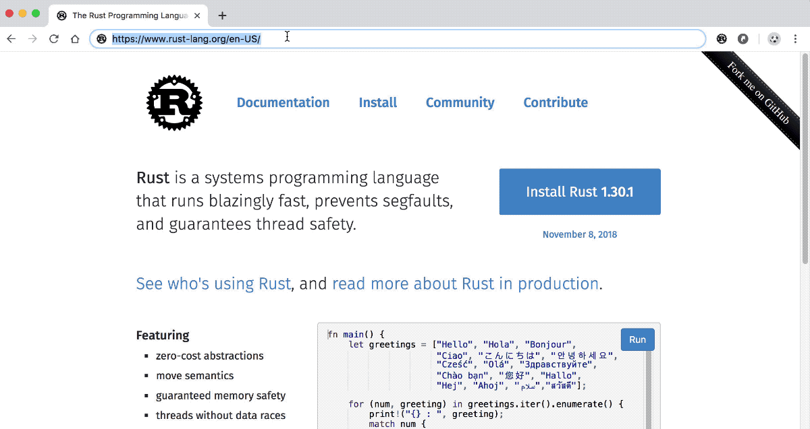
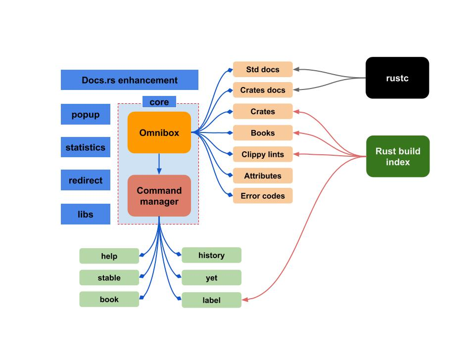

# Rust Search Extension

### The ultimate search extension for Rust 


[](https://doc.rust-lang.org/1.44.0/std/)
[](https://github.com/huhu/rust-search-extension/blob/master/LICENSE-MIT)
[](https://github.com/huhu/rust-search-extension/blob/master/LICENSE-APACHE)
[](https://discord.com/invite/UAzW4A)

Search **docs**, **crates**, builtin **attributes**, official **books**, and **error codes**, etc in your address bar instantly. 

[https://rust-search-extension.now.sh/](https://rust-search-extension.now.sh/)

## Installation

- [Chrome Web Store](https://chrome.google.com/webstore/detail/rust-search-extension/ennpfpdlaclocpomkiablnmbppdnlhoh)

- [Firefox](https://addons.mozilla.org/en-US/firefox/addon/rust-search-extension/)

- [Microsoft Edge](https://microsoftedge.microsoft.com/addons/detail/olemfibpaicdoooacpfffccidjjagmoe)

## Features

- Search Primitive Types and Modules
- Search Structs, Traits and Enums
- Search Functions, Methods and Macros
- Search builtin attributes 
- Search crates on https://crates.io or https://lib.rs
- Search crate's docs on docs.rs
- Search [Compiler Error Index](https://doc.rust-lang.org/error-index.html) with error codes
- Search Rust official book chapters
- Search Cargo Clippy lints
- Offline mode, search local Rust docs (`rustup docs --std`)
- Builtin commands (`:yet`, `:book`, `:stable`, `:book`, `:label`, `:tool` and `:history` etc)
- Docs.rs enhancements (display Feature flags)

## How to use it

Input keyword **rs** in the address bar, press `Space` to activate the search bar. Then enter any word 
you want to search, the extension will response the related search results instantly.



## Diagram



## Contribution

```bash
$ git clone --recursive https://github.com/huhu/rust-search-extension
Cloning into 'rust-search-extension'...
$ cd rust-search-extension

$ make chrome # For Chrome version

$ make firefox # For Firefox version

$ make edge # For Edge version
```

## Get involved

- You can contact us on Discord Channel: https://discord.com/invite/UAzW4A
- Or by adding the Wechat ID: `huhu_io`, we'll invite you to our Wechat group.


## Miscellaneous

- [Changelog](https://rust-search-extension.now.sh/changelog/)
- [FAQ](https://rust-search-extension.now.sh/faq/)

## Thanks

Thanks for the sponsorship from these great companies.

[](https://www.jetbrains.com/?from=rust-search-extension)

[](https://vercel.com?utm_source=rust-search-extension)
